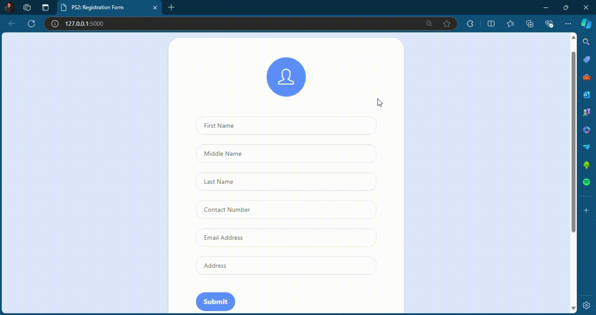

<div style="background-color: white; padding: 20px;">
 
<p align="center">
 
</p>

<h2 align="center">CCCS 106 - Application Development and Emerging Technologies</h2>

<div align="center">

[](https://www.python.org/downloads/release/python-3126/)
[](https://flask.palletsprojects.com/en/latest/)
[](https://werkzeug.palletsprojects.com/en/3.0.x/)


<h4>This repository is intended for academic purposes only specifically in Application Development and Emerging Technologies course. All PS activities and its sample run are uploaded here to be graded.</h4>

</div>

-----------------------------------------

### PS1

* PS1 is a simple Flask application that ask a user to input his/her name. The flask program contains this route `/` which renders a simple HTML form named `PS1.html` that asks for the user's name. When the user submits the form, the application redirects to the `/greet` route which greets the user with a message "Hello World! {name}, welcome to CCCS 106 - Applications Development and Emerging Technology".
------------------------------------------
### PS1 Demo

* `Enter your name`

<p align="center">
 
</p>

<br> 

------------------------------------------

### PS2

* PS2 is a Flask registration form that asks the user to input his/her first name, middle name, last name, birth date, email, and address. The flask program contains this route `/` which renders the html form `PS2.html` where the user inputs its information. The form also contains a submit button which when clicked, the application redirects to the `/submit` route which displays the user's information in a `JSON` file with a message "Data saved successfully to a JSON file".
------------------------------------------
### PS2 Demo

* `Enter first name`
* `Enter middle name`
* `Enter last name`
* `Enter birth date`
* `Enter email`
* `Enter address`

<p align="center">
 
</p>

<br> 

------------------------------------------

### PS3

* PS3 is an improved Flask registration form of the previous Problem Set 2. Just like the previous version. It still ask for the user's personal information. The only difference is where the data is stored. In this version, the data is stored in a `MySql` database named `adet` and in the table named `adet_avila`. The flask program contains this route `/` which renders the html form `home.html` which act as the home page of the application. It has an `input information` button that when clicked, the application redirects to the `/form` route which renders the html form `PS3.html` where the user inputs its information. The form also contains a submit button which when clicked, the application redirects to the `/submit` route which can redirect to `home.html` with a message "Information successfully recorded!". However, if the email is already taken, the application will redirect back to the `/form` with a message "Email is already taken. Use other email instead.".

The Problem Set 3 registration form with MySql database imported the following libraries and modules:
* `flask`
* `flask-mysqldb - MySQL`
* `MySQLdb`
* `yaml` - I used this to store the database configuration and hide my user name and password. This is to avoid        exposing my credentials in the code. If you want to use this, you can create a `db.yaml` file and store your database's host, username, password, and the database to use. The format should be like this:

```yaml
    mysql:
            mysql_host: 'localhost`
            mysql_user: 'yourusername'
            mysql_password: 'yourpassword'
            mysql_db: 'adet'
```

------------------------------------------
### PS3 Demo

* `Enter first name`
* `Enter middle name`
* `Enter last name`
* `Enter birth date`
* `Enter email`
* `Enter address`

* Since the email has a `UNIQUE` constraint in the database, the application will not allow the user to input the same email twice. Therefore, the application will redirect back to the form with a message "Email is already taken. Use other email instead."

<p align="center">
 
</p>

<br>

------------------------------------------

### Implementation Details

This repository as of now contains the implementation of flask applications for PS1, PS2, and PS3. In the latest discussion of our Instructor, we are introduced to the implementation of MySQL database in our flask applications. In the latest Problem Set 3, we are tasked to create a registration form that stores the user's information in a MySQL database.

1. `Flask` - Flask is mostly known as a web "micro-framework" developed in python. This is small enough to be easy to learn and create applications out of it. What I find out in Flask is that it's a very beginner-friendly framework that is easy to understand and use. - [Educative-Intro-to-Flask](https://www.educative.io/courses/flask-develop-web-applications-in-python/what-is-flask) , [Flask-Web-Dev](https://coddyschool.com/upload/Flask_Web_Development_Developing.pdf)

2. `MySQL` - MySQL is an open-source relational database management system. It is a database management system that is based on SQL (Structured Query Language). It is used for managing databases, web applications, and websites. - [MySQL-Tutorial](https://www.mysqltutorial.org/)
------------------------------------------

### Prerequisites

1. [Python 3.12.6](https://www.python.org/downloads/release/python-3126/)
2. [XAMPP 8.0.30](https://sourceforge.net/projects/xampp/files/XAMPP%20Windows/8.0.30/xampp-windows-x64-8.0.30-0-VS16-installer.exe) (For Windows)
3. [XAMPP 8.0.28](https://sourceforge.net/projects/xampp/files/XAMPP%20Mac%20OS%20X/8.0.28/xampp-osx-8.0.28-0-installer.dmg) (For OS X)
------------------------------------------
### Installation

* Step I: Clone the Repository
```sh
      $ git clone https://github.com/Devcavi19/ADET-BSCS3B
```

* Step II: Install the required packages
```sh
      # On the terminal, move into the ADET-BSCS3B directory or just choose the directory where the repository is cloned
      $ cd ADET-BSCS3B
      $ pip install -r requirements.txt
```

* Step III: Run the code
```sh
      # To run run the flask application
      $ python PS1.py

      # or run the other flask applications
      # $ python PS2.py
      # $ python PS3.py
```

------------------------------------------
### Contributor

Herald Carl Avila - [Devcavi19](https://github.com/Devcavi19)

------------------------------------------
</div>